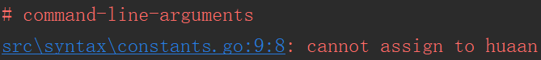

[CODE](../src/syntax/constants.go)

Go还支持常量。
常量本质上是变量，一旦定义，其值之后不能被修改。
和创建变量的方式相同，但改`var`关键字为`const`关键字。

```
const motto string = "耳光随便打、钱一定要给！"
```

常量声明定义被命名的值，语义上看起来像变量，但它的值是恒定不变的，这防止在程序执行过程中意外或非法的修改。

每个常量潜在的类型是基础类型：布尔型、字符串型、数值型。

